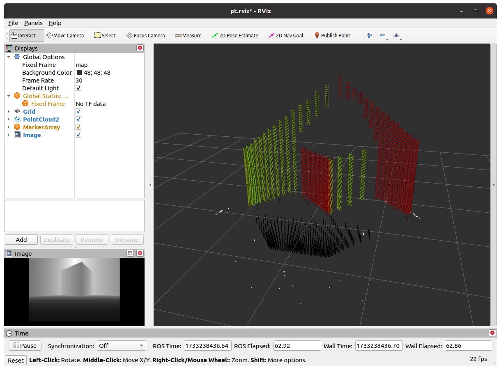
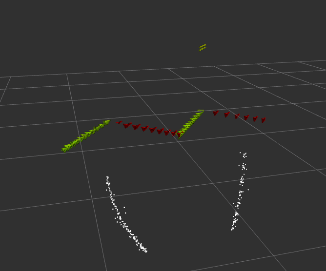
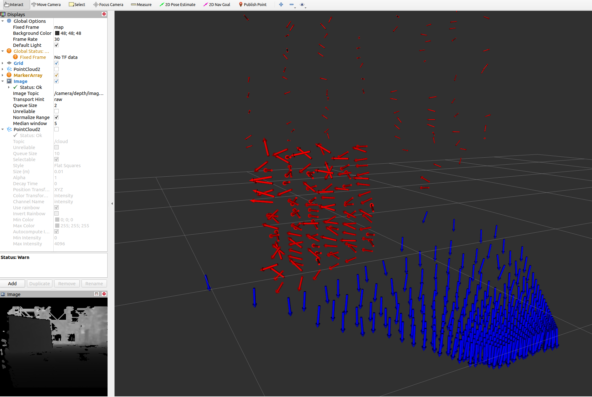

# PointCloud2DepthImage

## depth_converter

点云转深度图

平台：ROS noetic

GPU：RTX 3060 (8.6)

CUDA: 12.0

目前假设雷达，水平FOV为360度，垂直FOV为[-52,7]度

在雷达坐标系中，每个点与原点构成一条光线，这个光线的长度为该点的深度，这条线在三维极坐标系下有水平夹角 $\theta$ 和垂直夹角 $\phi$ ，两个夹角的值也对应着深度图中对应的像素坐标。转换公式为：

$$
\begin{array}{l}
\theta=\text{sign} (y) \cdot \text{arccos} (\cfrac{x\sqrt{x^2+y^2+z^2}}{\sqrt{x^2+y^2}})\\
\phi=\text{arcsin}(\cfrac{z}{\sqrt{x^2+y^2+z^2}})\\
d=\sqrt{x^2+y^2+z^2}
\end{array}
$$

$$
\begin{array}{l}
x=d \text{cos}\theta \text{cos}\phi\\
y=d \text{sin}\theta \text{cos}\phi\\
z=d\text{sin}\phi
\end{array}
$$

输入：点云sensor_msg::PointCloud2，话题名为/scan

转化为cv::Mat深度图，深度图的数据类型为CV_32FC1

输出：深度图sensor_msg::Image，话题名为/depth

run：

    rosrun depth_converter transfer

v1.0为cpu版本

v2.0为gpu版本

参考了FUEL中的仿真部分：https://github.com/HKUST-Aerial-Robotics/FUEL.git

## depth_cut

深度图计算每点法向量来切分平面

运行后生成一张图，显示相机系下每个点的法向量

隔100个点采样一次

图中左下角为深度图，右侧白色点为法向量和在法向量上投影的长度，其余颜色的箭头表示空间中的点云和其法向量

但是在不同平面的交界处，会产生这种法向量计算不准的情况，导致其在一定的范围内波动，产生噪声，如下图所示

实际使用d435i测试一下，竖直的纸板表面深度是波浪型的，实物相机参数需要调整,光影响比较大，建议晚上弄相机

